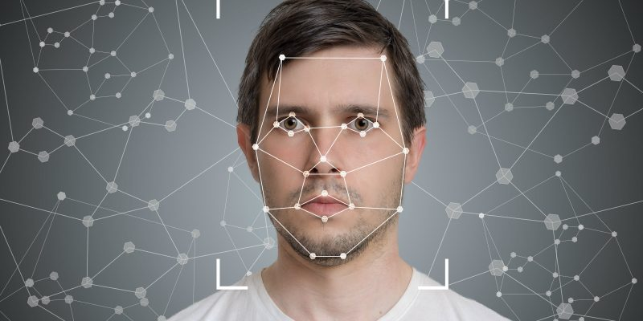

# Proyecto de Reconocimiento Facial

Este proyecto es una implementación básica de un sistema de reconocimiento facial utilizando Python y bibliotecas populares como OpenCV y imutils.



## Descripción

El reconocimiento facial es una tecnología que identifica o verifica automáticamente a una persona a partir de una imagen digital o un video. En este proyecto, implementaremos un sistema de reconocimiento facial que puede detectar y reconocer rostros pertenecientes a docentes de una institución educativa.

## Funcionalidades

- Detección de rostros en imágenes y videos.
- Entrenamiento de un modelo de reconocimiento facial utilizando opencv.
- Integración con cámaras web para la detección y reconocimiento en tiempo real.

## Tecnologías Utilizadas

- Python
- OpenCV

## Instalación

Clona este repositorio en tu máquina local:

   ```bash
   git clone https://github.com/caitcyan/proyecto-reconocimiento-facial.git
```
## Estructura de la Carpeta

- **.git**
  - Tipo: File folder

- **Codigos**
  - Tipo: File folder

- **Data**
  - Tipo: File folder

- **imagenes**
  - Tipo: File folder

- **.gitignore.txt**
  - Tipo: Text Document
  - Tamaño: 1 KB

- **README.md**
  - Tipo: MD File
  - Tamaño: 1 KB

## Estructura de la Carpeta Data

- **CENTRO EDUCATIVO**
  - Tipo: File Folder
  - PRE
  - POST

- **INTRUSOS**
  - Tipo: File Folder

- **Videos Procesados**
  - Tipo: File Folder